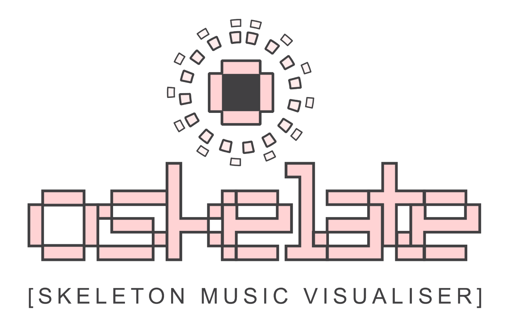

# Oskelate

Oskelate is a skeleton music visualiser built in Pure Data (Pd) and Java.

There are two core sets of functionality built into this system:

- elements which respond to audio input via a microphone
- elements that respond to the performer's skeleton data via Microsoft/X-Box Kinect.

By combining these two responses, Oskelate looks to provide musicians with ability to create a unique visual component to their performance that represents not only the audio qualities of their music but also the kinetic movement of the performer on stage.

## Setting up Kinect

Before you start using Oskelate, you will need to plugin and position your Kinect within the performance space. There are a few considerations to take into account when doing this which heavily affect the tracking abilities of the Kinect.

## Effects

### Luma Offset

The luma offset module redistributes the pixels of the source footage by their luminosity values according to the setting defined by the user. The spacing between the pixel distribution and banding can be controlled by either audio or skeleton response. The fill closing the holes between the pixel spacing and smoothing can be turned off and on.

### Refraction

The refraction module divides the source signal into cells to give an appearance similar to glass refraction. The magnitude of refraction, height and width of these cells can be controlled by either audio or skeleton response while image magnification and be toggled on and off.

### Kalei

The kalei module creates a number of segments from the centre of the source video. The number of the segments (magnitude), the rotation of the video input and video output can be controlled using audio or skeleton response.

### OskWave

The video is rendered onto a surface moving along a waveform. The shape of this waveform can be selected using the graphic user interface. The force, amount of noise and height of the waveform can be controlled using audio or skeleton response. The images shown here are only a small sample of what can be achieved with this module.

## Credits

- PureData effect and Kinect development: Ryan Achten
- Java UI and Pure Data integration: Jason Pather, Joshi Shushruth and Simon Clark
